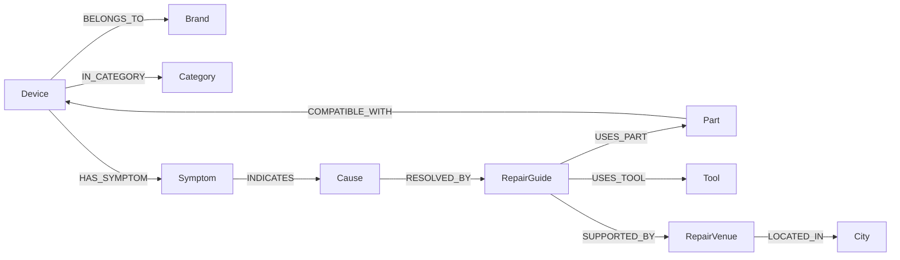

# FixFlow

FixFlow is a graph-powered repairability navigator for everyday electronics. The app helps someone move from a device and a symptom to the most likely causes, the right parts, tools, guides, and nearby repair venues.

This project is designed for CognoDB using openCypher and the official Neo4j driver. It includes:

- a labeled graph schema with typed relationships
- a realistic seed script that generates a connected graph
- parameterized Cypher queries, including multi-hop traversals and a query that would be awkward in a relational schema
- a FastAPI backend with graceful database-unavailable handling
- a React + TypeScript frontend with loading, empty, and error states
- setup notes, query explanations, and architecture documentation

## Why graph instead of relational

This problem is naturally about connections:

- one device can have many symptoms
- one symptom can map to many probable causes
- one repair guide can need multiple parts and tools
- one part can fit many devices
- one venue can support many repair types and brands

A relational schema can model this, but the interesting questions are multi-hop and path-oriented:

- "Given a laptop and a symptom, which repair guides, parts, and tools should I look at next?"
- "Which symptoms and devices are reachable from this part within three hops?"
- "Which nearby venues support guides for this family of devices?"

Those are the kinds of traversals graph databases are built for. In FixFlow, the graph gives us direct, expressive queries instead of a pile of joins.

## Graph model



## Repository layout

- `backend/` FastAPI application and Neo4j repository layer
- `frontend/` React + Vite UI
- `database/` schema and query examples
- `seed/` graph seed script
- `docs/` supporting architecture notes and interview prep

## Prerequisites

- Python 3.11+
- Node.js 20+
- a CognoDB or Neo4j-compatible Bolt endpoint for live seeding

## Setup

1. Copy `.env.example` to `.env` in the repository root and fill in your CognoDB credentials.
2. Copy `frontend/.env.example` to `frontend/.env` if you want to override the frontend API URL.
3. Install backend dependencies:

```bash
cd backend
python -m venv .venv
source .venv/bin/activate
pip install -r requirements.txt
```

4. Install frontend dependencies:

```bash
cd frontend
npm install
```

5. Seed the database:

```bash
cd seed
python seed.py
```

6. Run the backend:

```bash
cd backend
uvicorn app.main:app --reload --port 8000
```

7. Run the frontend:

```bash
cd frontend
npm run dev
```

If the database is not reachable, the backend switches to a safe demo mode so the frontend still works with bundled sample data.

## Assignment fit

This repository is shaped to match the assignment checklist:

- original use case: repairability navigator
- graph schema with labels, properties, and relationship types
- parameterized Cypher queries
- multi-hop traversal examples
- functional web app
- graceful handling when CognoDB is unavailable
- seed script and schema file
- supporting docs for setup and explanation

What still needs a live environment before final submission:

- a real CognoDB Bolt endpoint
- a successful seed run against that endpoint
- screenshots from the running app
- hosted demo and recording links

## Main queries

The examples live in [`database/queries.cypher`](database/queries.cypher).

Highlights:

- device discovery by category and search term
- symptom to guide traversal
- multi-hop recommendation path from `Device -> Symptom -> Cause -> RepairGuide -> Part -> Tool`
- nearby venue lookup
- a relationally awkward query that answers: "Which devices and symptoms are connected through the same guide, part, and venue chain?"

## CognoDB creation

This project assumes a CognoDB instance is already provisioned. If you are creating a new database, use the managed service workflow provided by CognoDB, then point `COGNODB_URI`, `COGNODB_USER`, and `COGNODB_PASSWORD` at the new Bolt endpoint.

## Screenshots

This repository is built so you can capture screenshots after launch. The user-facing pages are:

- Home dashboard
- Device detail view
- Insights explorer
- About and setup

## Hosted demo

No hosted deployment was produced from this environment. If you deploy it to Vercel, Netlify, Render, or a similar service, add the final demo URL and recording link here.

## Query examples

The project ships with:

- schema constraints in [`database/schema.cypher`](database/schema.cypher)
- seed logic in [`seed/seed.py`](seed/seed.py)
- backend query helpers in [`backend/app/queries.py`](backend/app/queries.py)

## License

Provided for assignment use.
